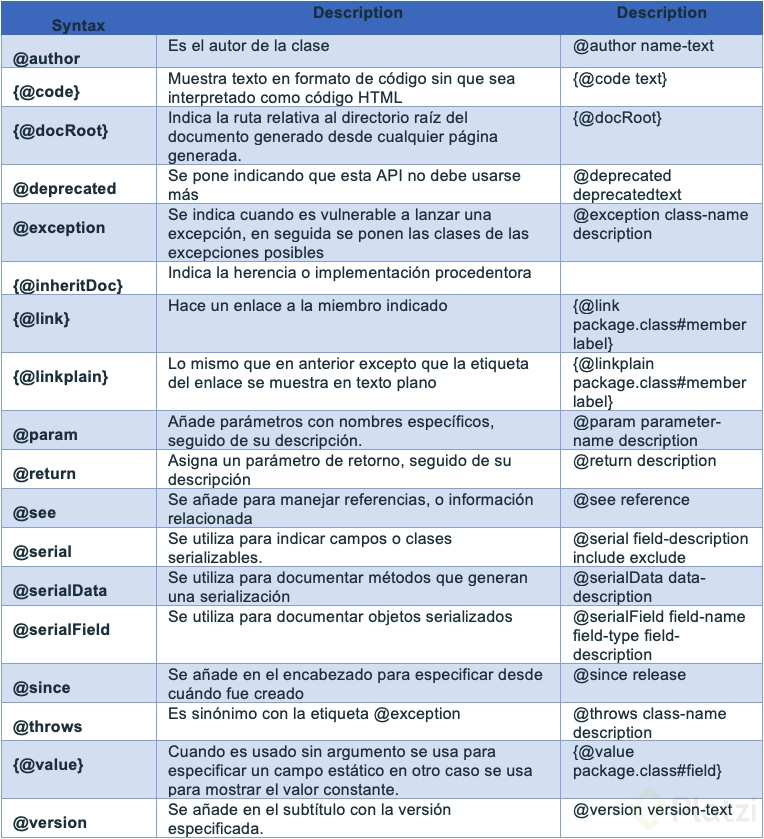

# JAVA SE

## CONOCE A JAVA COMO LENGUAJE DE PROGRAMACIÓN

### ¿QUÉ ES JAVA?

**¡Te damos la bienvenida al Curso Básico de Java SE!**

Java es un lenguaje de programación de alto nivel (aunque no tan alto como Python o JavaScript) que nos ayuda a construir aplicaciones para diferentes dispositivos y sistemas operativos.

Fue creado en 1991 por James Gosling mientras trabajaba en Sun Microsystems, una empresa que luego fue adquirida por Oracle. Esto significa que Java tiene muy buen mantenimiento, pero también algunos cambios con los que no todos estaremos de acuerdo.

Java tiene dos categorías:

1. Standard Edition para construir aplicaciones de escritorio o consola.
2. Enterprise Edition para que las empresas trabajen aplicaciones web de última generación.

En este curso aprenderemos los fundamentos de Java Standard Edition:

- la sintaxis del lenguaje.
- declarar variables.
- trabajar con funciones.
- ciclos y condicionales.
- lógica de programación.
- algoritmos y muchas otras cosas.

Pero no te preocupes. Java sigue filosofía de Write Once, Run Anywhere (WORA), por lo que todo lo que aprendas en este curso lo podrás aplicar también con Java EE.

Puedes continuar tu ruta de aprendizaje de Java SE con estos otros cursos:

- Curso de Java SE: Orientado a Objetos
- Curso de Java SE: Programación Funcional

### VERSIONES DE JAVA Y JDK

El JDK o Java Development Kit se compone de los siguientes elementos:

- Java Runtime Environment (JRE): La máquina virtual de Java, lo que nos permite que al escribir el mismo código funcione igual en todos los dispositivos y sistemas operativos.
- Compilador de Java: El encargado de traducir nuestro código en Java a un lenguaje que puede entender e interpretar nuestra máquina virtual.
- APIs de desarrollo: Una base de código lista para ayudarnos a desarrollar.

Las APIs de desarrollo con Java han evolucionado con el tiempo, por lo que existen diferentes versiones de java que puedes utilizar. La versión que más elevo la popularidad y las ofertas de trabajo con Java fue Java SE 6.

En Java SE 9 anunciaron que las actualizaciones ocurrirían cada 6 meses, pero las versiones LTS (Long Time Support) tendrán mantenimiento por 3 años, así que las actualizaciones son necesarias, pero no urgentes.

En este curso vamos a trabajar con la versión Java SE 11 LTS, la primera versión de Java con licencia. Solo podremos usarlo gratis cuando trabajemos en ambientes de desarrollo y testing. De otra forma, debemos pagar 2.5 USD al mes por usuario de escritorio y 25 USD por procesador para aplicaciones de servidor.

Afortunadamente, OpenJDK es una versión gratis y open source de usar Java SE Platform Edition.

### LAS HERRAMIENTAS MÁS USADAS DE JAVA

Java 8 (LTS) es la versión más usada de Java hasta inicios del 2019, pero solo tendrá soporte hasta diciembre del 2020, luego de esta fecha tendremos que pagar una licencia para continuar con su soporte.

Java 10 introdujo algunos cambios en la forma de declarar variables, así que en este curso vamos a trabajar con las versiones 8 y 11 de Java.

La herramienta más usada para construir proyectos web con Java es Maven, pero también existen otras alternativas como Gradle. También existen frameworks como Spring para trabajar con Java EE y ORMs como Hibernate para trabajar con bases de datos.

Los IDEs son entornos de desarrollo integrados, herramientas (aplicaciones, seguramente de escritorio) que nos ayudan a escribir nuestro código con editores, compiladores, depuradores y constructores de interfaces gráficas, todo en un mismo lugar.

El IDE recomendado por Oracle es NetBeans, pero también están Eclipse e IntelliJ IDEA, este último es el que más fuerza ha tomado gracias a Kotlin. Las tres herramientas son gratuitas, pero IntelliJ IDEA también tiene una versión de pago.

### ETAPAS DE LA PROGRAMACIÓN

1. Escribir nuestros archivos .java.
2. Compilar, cargar y verificar nuestros archivos con javac (los IDEs nos permiten compilar con solo presionar un botón).
3. Al compilar obtenemos archivos .class con código que nuestras computadoras pueden entender (Byte Code).
4. La JVM (Java Virtual Machine) se encarga de ejecutar el código de forma que funcione en cualquier dispositivo o sistema operativo.

Java es un lenguaje compilado e interpretado al mismo tiempo.

## VARIABLES EN JAVA

### CONVENCION DE NOMBRES

Una convención de nombres es un patrón que deben seguir los nombres de las variables para que el código esté organizado, entendible y sin repetidos.

- Java es sensible a mayúsculas y minúsculas, este punto es clave al seguir una convención.
- Las variables siempre deben comenzar con un simbolo de letra, $ o _.
- No puedes usar el simbolo - en ninguna parte de la variable.

Las variables constantes son variables cuyo valor nunca va a cambiar, por lo que se deben escribir completamente en mayúsculas y usando el caracter _.

### JAVA DOCS

Los Java Docs son una herramienta usada por muchas otras herramientas y aplicaciones porque nos ayuda a documentar todo nuestro código usando comentarios. Además, nos permite visualizar la documentación en formato HTML.

Vamos a documentar la función convertToDolar. Recuerda que esta función devuelve un número double y recibe dos argumentos: quantity (de tipo double) y currency (de tipo String):

```java
/**
 * Descripción general de nuestra función.
 * 
 * @param quantity Descripción del parámetro quanity.
 * @param currency Descripción del parámetro currency (MXN o COP).
 * @return Descripción del valor que devolvemos en esta función.
 * *
```

Para que el IDE muestre la descripción y documentación de las funciones debemos entrar a IntelliJ IDEA > Preferences > Editor > General > Code Complettion y habilitar la opción de Show the documentarion popup.

¡No olvides documentar todas las funciones que has escrito hasta ahora!


